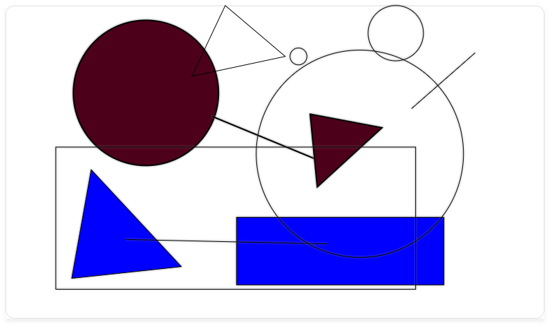
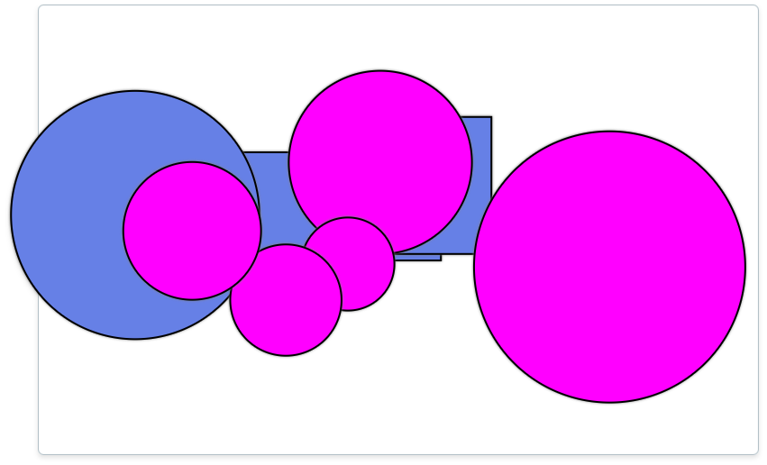

# 🎨 Draw - Application de Dessin JavaFX


## 📝 Description

Draw est une application de dessin moderne développée en JavaFX, offrant une interface utilisateur intuitive et des fonctionnalités avancées de création graphique. Cette application permet aux utilisateurs de créer, modifier et sauvegarder des dessins avec une variété d'outils et d'options.

## ✨ Fonctionnalités

- Interface utilisateur moderne et intuitive
- Outils de dessin variés
- Support pour différentes formes et couleurs
- Sauvegarde et chargement de dessins
- Interface responsive et adaptative

## 🛠️ Technologies Utilisées

- Java 24
- JavaFX 17.0.6
- Maven 3.13.0
- ControlsFX 11.2.1
- Ikonli (pour les icônes)
- JUnit 5.10.2 (pour les tests)

## 🚀 Installation

1. Clonez le repository :
```bash
git clone [URL_DU_REPO]
```

2. Naviguez vers le dossier du projet :
```bash
cd Draw
```

3. Compilez le projet avec Maven :
```bash
mvn clean install
```

4. Lancez l'application :
```bash
mvn javafx:run
```

## 📁 Structure du Projet

```
Draw/
├── src/
│   ├── main/
│   │   ├── java/
│   │   │   └── com/example/demo1/
│   │   │       ├── controller/    # Contrôleurs JavaFX
│   │   │       ├── model/         # Modèles de données
│   │   │       ├── services/      # Services métier
│   │   │       └── utils/         # Utilitaires
│   │   └── resources/            # Ressources (FXML, CSS, images)
│   └── test/                     # Tests unitaires
├── pom.xml                       # Configuration Maven
└── README.md                     # Documentation
```

## 🖼️ Captures d'écran




## 🤝 Contribution

Les contributions sont les bienvenues ! N'hésitez pas à :

1. Fork le projet
2. Créer une branche pour votre fonctionnalité (`git checkout -b feature/AmazingFeature`)
3. Commit vos changements (`git commit -m 'Add some AmazingFeature'`)
4. Push vers la branche (`git push origin feature/AmazingFeature`)
5. Ouvrir une Pull Request

## 📄 Licence

Ce projet est sous licence MIT. Voir le fichier `LICENSE` pour plus de détails.

## 👥 Auteurs

- Votre Nom - Développeur Principal

## 📞 Contact

Pour toute question ou suggestion, n'hésitez pas à ouvrir une issue dans le repository.

---

⭐ N'hésitez pas à donner une étoile au projet si vous l'appréciez ! 